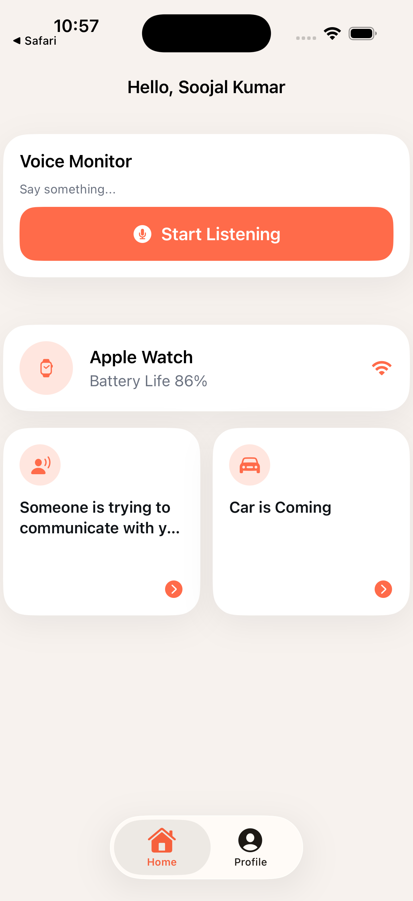

# EchoWear

EchoWear is a Swift-based iOS/watchOS prototype that combines speech recognition, authentication, and a clean wearable-focused interface for experimenting with voice-driven interactions.

License: Not specified.

## Overview

EchoWear explores a simple wearable-first voice monitoring experience. The iOS app includes a modern SwiftUI sign-in flow, a voice monitor surface, configurable speech recognition behavior, and project structure for Apple Watch-related work.

The current project is best suited for demos, portfolio review, and continued prototyping in Xcode.

## Features

- SwiftUI interface with a clean wearable-focused visual style
- Working `EchoWearios` iOS target with iOS Simulator support
- Speech recognition support through Apple's Speech framework
- Microphone-driven listening flow through AVFoundation
- Demo authentication flow with Apple, email/password, and simulated Google options
- Keychain-based credential storage for email/password hashes
- Clean modern sign-in UI
- watchOS-related structure present in the project
- App icon assets organized for iOS builds
- Unit/UI test folders included for future coverage expansion

## App Screenshots

| Sign In | Home |
| --- | --- |
|  |  |

| Speech Recognition |
| --- |
|  |

## Tech Stack

- Swift
- SwiftUI
- Xcode project format
- Speech framework
- AVFoundation
- AuthenticationServices
- CryptoKit
- Security / Keychain Services
- UserNotifications
- iOS Simulator
- watchOS project structure

## Project Structure

```text
EchoWear-Working/
├── EchoWear/
│   ├── EchoWear.xcodeproj/
│   │   ├── project.pbxproj
│   │   └── xcshareddata/
│   ├── EchoWearios/
│   │   ├── AuthenticationManager.swift
│   │   ├── ContentView.swift
│   │   ├── EchoWeariosApp.swift
│   │   ├── ModernSignInView.swift
│   │   ├── SpeechRecognizer.swift
│   │   └── Assets.xcassets/
│   ├── EchoWearWatch/
│   ├── EchoWearTests/
│   ├── EchoWearUITests/
│   ├── EchoWeariosTests/
│   └── EchoWeariosUITests/
├── docs/
│   └── screenshots/
├── README.md
└── .gitignore
```

## How to Run

1. Clone the repository.
2. Open `EchoWear/EchoWear.xcodeproj` in Xcode.
3. Select the `EchoWearios` scheme.
4. Select an iPhone Simulator.
5. Press `Command + R`.

Requirements:

- Xcode is required.
- An iOS Simulator runtime is required.
- Microphone and Speech Recognition permissions may be requested when using voice features.

## Demo Login

Use any valid email and any password with at least 6 characters. If the account does not exist locally, the app creates a demo account automatically.

Example:

```text
Email: test@example.com
Password: 123456
```

`Continue with Google` is a simulated demo flow. It is not production Google OAuth yet.

## Permissions Required

- Microphone access for audio input
- Speech Recognition permission for speech-to-text
- Notification permission when voice detections are used
- Apple Sign In capability for production Apple authentication flows

## Current Status

- Project runs in the iOS Simulator.
- The working iOS scheme is `EchoWearios`.
- Good for demo, prototype, and portfolio use.
- Authentication is not production-ready.
- Real Google Sign-In is not implemented yet.
- Some watchOS integration structure exists, but deeper Apple Watch behavior still needs expansion.

## Future Improvements

- Real Google Sign-In
- Better speech recognition error handling
- Cloud sync
- App Store-ready icons and metadata
- More watchOS integration
- Unit/UI test expansion
- Real backend authentication
- Emergency contact workflows
- Accessibility and localization polish

## Author

Soojal Kumar
